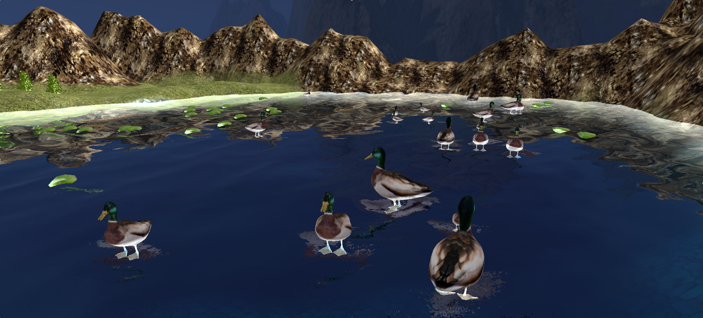

# Duck simulator
Simulateur de vie de canards en 3D développé avec le moteur graphique JMoneyEngine.
Les canards grandissent lorsqu'ils se nourissent de nénuphars.

## Prérequis
- Java 7 minimum

## Comment jouer
- Executer `MyGame.exe` dans le dossier `Game`.
- Se déplacer en utilisant `z`,`q`,`s`,`d`, `espace` et `maj`.

## Image
